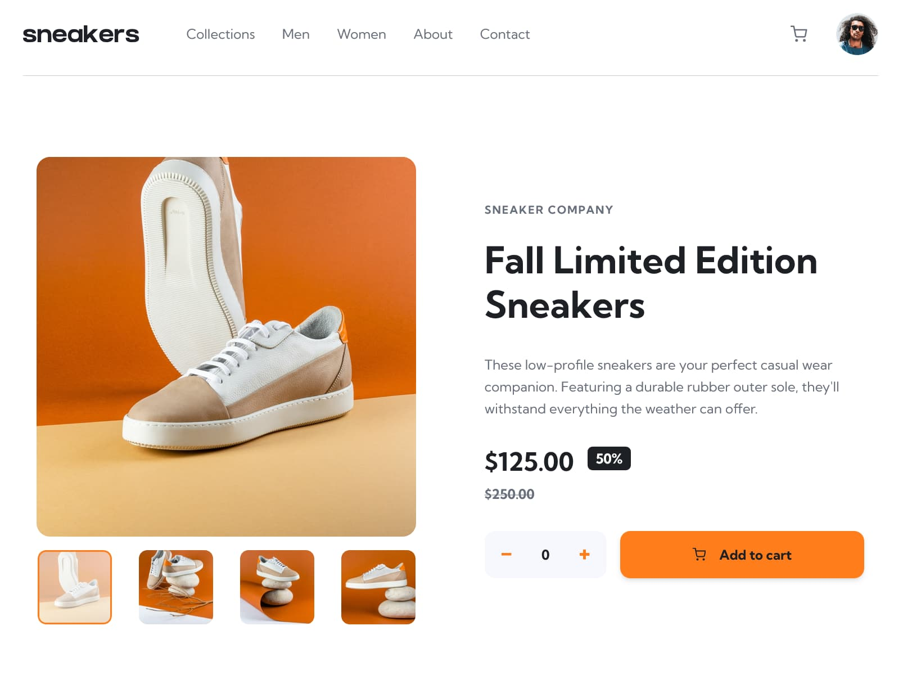

# E-Commerce Product Page



## Table of Contents

- [Overview](#overview)
  - [Features](#features)
  - [Links](#links)
  - [Built with](#built-with)
  - [Project Structure](#project-structure)
- [Architecture & Key Decisions](#architecture--key-decisions)
  - [State Management](#state-management)
  - [Accessibility](#accessibility)
- [Author](#author)

## Overview

An interactive product page built with React and Tailwind CSS, including image gallery, lightbox, and shopping cart. 

This is a solution to the [E-commerce product page challenge on Frontend Mentor](https://www.frontendmentor.io/challenges/ecommerce-product-page-UPsZ9MJp6) and required project in Frontend Mentor's Web Accessibility learning path. Frontend Mentor challenges help you improve your coding skills by building realistic projects.

### Features

Users should be able to:

- View the optimal layout for the site depending on their device's screen size
- See hover states for all interactive elements on the page
- Open a lightbox gallery by clicking on the large product image
- Switch the large product image by clicking on the small thumbnail images
- Add items to the cart
- View the cart and remove items from it

### Links

- [live demo site](https://jovial-dusk-f6c8c4.netlify.app)
- [Frontend Mentor solution page]()

### Built with

- Semantic HTML5 markup
- Flexbox
- CSS Grid
- Mobile-first workflow
- Tailwind CSS
- [Vite](https://vite.dev/) - Build tooling, including dev server and asset imports and optimization
- [React](https://reactjs.org/) - JS library
- [react-focus-lock](https://www.npmjs.com/package/react-focus-lock) - Focus trapping for modal dialogs
- [react-remove-scroll](https://www.npmjs.com/package/react-remove-scroll) - Background scroll locking for modals

### Project Structure

```
src/
├── App.jsx                       # Root: CartProvider, skip link, LiveAnnouncer, Header, ProductPage
├── context/
│   └── CartContext.jsx           # Cart state, shared across Header and ProductInfo
├── hooks/
│   ├── useMediaQuery.js          # Breakpoint detection for JS-level behavior (not just CSS)
│   └── useOnClickOutside.js      # Dismiss non-modal disclosures (cart dropdown) on outside click
├── data/
│   ├── product-data.js           # Product data: images, pricing, description
│   └── nav-links.js              # Shared nav data for desktop and mobile nav
└── components/
    ├── Header.jsx                # Logo, nav, cart button + dropdown
    ├── MobileMenu.jsx            # Dedicated slide-out menu component (mobile/tablet)
    ├── ProductPage.jsx           # Semantic landmark for gallery and info render
    ├── ProductGallery.jsx        # Featured image, thumbnails (desktop), arrows (mobile/tablet)
    ├── GalleryThumbnail.jsx      # Single gallery item thumbnail button
    ├── GalleryArrowButton.jsx    # Prev/next control buttons, handling style changes
    ├── GalleryLightbox.jsx       # Modal-based enlarged gallery, desktop only
    ├── Modal.jsx                 # Reusable accessible dialog primitive
    ├── ProductInfo.jsx           # Price, description, quantity, add-to-cart, error state
    ├── QuantitySelector.jsx      # Increment/decrement, floor of 0, ceiling of 99
    ├── CartPanel.jsx             # Shopping cart panel with FocusLock
    └── CartItem.jsx              # Single cart row with remove action
```

## Architecture & Key Decisions

This challenge is featured in Frontend Mentor's web accessibility learning path, so I took on an accessibility-focused mindset from the start. Throughout the dev process, I kept asking the question: how would someone using only a keyboard or with vision limitations experience the site? That guiding principle shaped my structural choices, use of semantic markup, and supplemental ARIA attributes. 

Additionally, I kept in mind that the project simulates a single product page on an e-commerce site that would likely have hundreds or thousands of products. Given that, I looked to break down the various components of the page into logical, reusable pieces.


### State Management

Since the core app state is required in various sibling components, I created a purpose-built component, CartContext, and utilized React Context and various other hooks to deal with cartItems state, the add/remove items functions, and an announcement feature for screen readers to better understand the current cart state.

Other pieces of state (isCartOpen, isNavOpen, gallery activeIndex, etc.) are kept at the lowest component level needed. Additionally, derived values are used for cart count, current price, and discount percentage to avoid multiple sources of truth or drifting values.


### Accessibility

The design comp is detailed, but I found a few gaps in the guidance. For example, there are no specific examples of keyboard-focused states for several interactive elements. Looking to achieve a minimum of 3:1 color contrast ratio, I added heavier outlines using the darkest versions of the primary and neutral brand colors, as well as some instances of white outlines where we have elements against a darker background.

After testing with a screen reader, I realized my original presentation of the crossed-out product price carried no meaning to an unsighted user. Going back, I added some visually hidden context as well as utilizing the more semanatic ```<s>``` tag:

**Semantic HTML & Landmarks**

* Utilized ```<button>``` elements for every interactive control (thumbnails, quantity select, cart, etc.)
* Proper page landmark elements (header, nav, main, section)
* A skip link to bring visitors to the ```<main>``` element
* Used the ```<output>``` element for the live quantity value, which gets the implicit role="status"
* Added the ```<s>``` tag for original price strike-through text, adding context for visually impaired users

```html
  <p className="font-bold text-brand-gray-500">
    <span className="sr-only">Original price: </span>
    <s>${product.fullPrice.toFixed(2)}</s>
  </p>
```

**Keyboard Navigation & Focus Management**

* Modal for gallery lightbox with tab trapping and focus lock, via React libraries, and close on Escape
* Focus-visible outlines used throughout for clear visual focus indicators
* Handled breakpoint-crossing edge case: An open lightbox or mobile nav closes based on window resize

**ARIA Patterns**
* ```aria-expanded``` and ```aria-haspopup="dialog"``` for cart button and mobile hamburger button
* ```aria-current``` for active gallery thumbnails, distinguishing between a current item is set vs. an item is toggled on semantically
* ```aria-label``` paired with ```aria-hidden="true"``` for icon-only buttons
* ```role="group"``` with a descriptive label wrapping related control clusters (thumbnail set, quantity selector)
* ```role="dialog"``` with ```aria-modal``` for modal

**Live Regions & Announcements**

* A persistently-mounted LiveAnnouncer with ```aria-live="polite"``` for background status updates (cart items added/removed, cart becomes empty)
* Announcements are force-reset to an empty string before being set, so two consecutive identical actions (e.g., adding a single item) are each announced (details below)
* ```role="alert"``` for the add-to-cart validation error, mounted only when relevant 

```html
  <div aria-live="polite" aria-atomic="true" className="sr-only">
    // message for screen readers
  </div>
  ```

During accessibility review testing, I discovered that when an item is added to the cart, and then another item in the same quantity is added, the announcement message remained identical; React wasn't detecting any need to update state, so no DOM updates were made, thus the screen reader wouldn't note the change. Added a setTimeout with useCallback to clear the live region first, then set the message a moment later, so the screen reader sees the DOM mutations.

```js
  const announe = useCallback((message) => {
      clearTimeout(clearTimeoutRef.current);
      setAnnouncement("");
      clearTimeoutRef.current = setTimeout(() => setAnnouncement(message), 100);
    }, []);
```

### The Shopping Cart drop-down

Among the many accessibility challenges this project design presented is the open cart panel state. The design calls for the cart to overlay the product page content rather than shift content down, allowing for much of the product image along with its controls to be obsured (especially on mobile).

I researched a handful of popular lifestyle brand websites to see what their experiences were like and found a lot of confusing and disappointing behevior for keyboard-only interactions, even for some of the sites with accessibility statements. Nike.com has somewhat similar behevior for some of the cart states to what this design calls for, and in those particular states they have a focus trap enabled, treating the cart panel as a modal. This felt closest to the spirit of what the design is calling for and the right balance for accessibility and usability. Allowing a user to tab through the open cart panel and on to potentially obscured elements behind it felt wrong.

I briefly considered conditionally applying the `inert` attribute to the rest of the page while the cart was open, but ultimately kept the same pattern I'd used with the lightbox gallery, treating the cart panel as a modal and reusing FocusLock library. Additionally, I didn't like that keyboard users could only close the shopping cart by way of the escape key, so I added an additional close button, similar to what was already implemented for lightbox modal. I think it matches the design well and provides some added usability.

## Author

- Website - [Matt Pahuta](https://www.mattpahuta.dev)
- Frontend Mentor - [@mattpahuta](https://www.frontendmentor.io/profile/MattPahuta)
- Bluesky - [@mattpahuta](https://bsky.app/profile/mattpahuta.bsky.social)
- LinkedIn - [Matt Pahuta](www.linkedin.com/in/mattpahuta)
